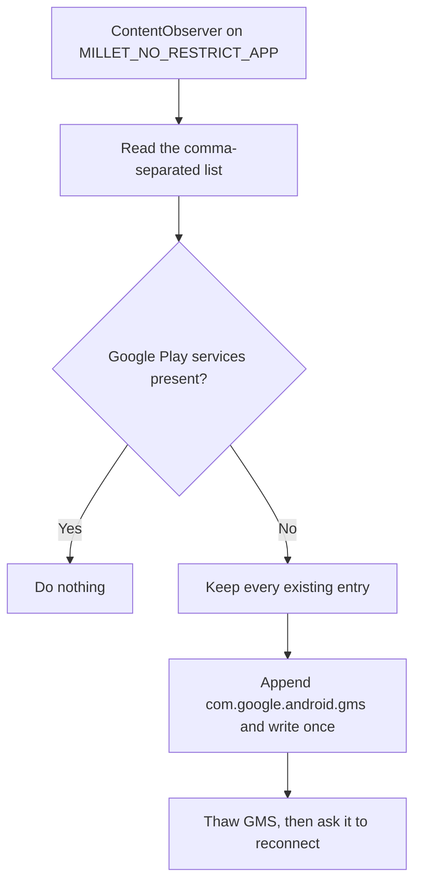

<p align="center">
  
</p>

<h1 align="center">MilletGuard</h1>

<p align="center">
  <strong>Keeps Google push notifications working on China-ROM HyperOS — no root, no Shizuku.</strong>
</p>

<p align="center">
  <a href="https://github.com/kemzsitink/MilletGuard/releases/latest/download/MilletGuard.apk"><strong>Download the latest APK</strong></a>
  ·
  <a href="https://github.com/kemzsitink/MilletGuard/releases">All releases</a>
</p>

HyperOS keeps a private allow-list of apps that its background manager (Millet / PowerKeeper) must not freeze:
`Settings.System.MILLET_NO_RESTRICT_APP`. The system rebuilds that list from time to time, and on China ROMs it can
drop **Google Play services**. Once that happens, the long-lived FCM connection gets frozen and push notifications
arrive late or not at all.

MilletGuard watches that one setting and puts Google Play services back the moment it disappears.

## Features

- **No root, Shizuku, or ADB** — only the user-grantable *Modify system settings* permission.
- **Event-driven and low power** — reacts to changes of the one watched setting, plus a non-waking 30-minute check.
- **One clear answer** — the home screen says whether push is protected and what the next step is.
- **Guided setup** — a 4-step checklist that ticks itself off as you return from each system page.
- **Push apps overview** — lists installed apps that use FCM, shows which are battery-limited, and links to each
  app's HyperOS settings.
- **Control Center tile** — toggle protection from Quick Settings; optionally hide the launcher icon.
- **Material 3 Expressive** — Jetpack Compose, dynamic color, light/dark, English and Vietnamese.

## Requirements

- A Xiaomi / Redmi / POCO phone on **HyperOS** (built and tested on HyperOS 3, China ROM).
- **Google Play services** already installed and working.
- Android 7.0 or newer.

## Setup

1. Install the APK from [Releases](https://github.com/kemzsitink/MilletGuard/releases).
2. Open MilletGuard and follow the **Setup** checklist on the home screen:
   1. **Allow system settings** — grant *Modify system settings*.
   2. **Turn on protection** — also puts Google Play services back on the list right away.
   3. **Let it start by itself** — enable HyperOS **Autostart** for MilletGuard. Some ROMs hide this status; tap
      **I did it** after enabling it.
   4. **Remove battery limits** — set MilletGuard to **No restrictions**.
3. Leave **Keep status notification** on (Settings). It is silent and makes HyperOS much less likely to stop the app.
4. Optional: add the **Control Center tile** when the home screen offers it, then hide the launcher icon. Long-press
   the tile to open the app. Removing the tile brings the icon back automatically.

If the icon is hidden and the tile is gone, restore the icon from a computer:

```sh
adb shell pm enable io.github.kemzsitink.milletguard/.LauncherAlias
```

### One app still gets late notifications?

MilletGuard protects the shared Google connection. Some apps — **WhatsApp** in particular — also need their own
process to run after an FCM wake-up. For those, set **App info → Battery saver → No restrictions** in HyperOS and
enable **Autostart**. The **Apps** tab lists battery-limited apps and opens each one's HyperOS settings.

## How it works



- **Only one setting is watched**, with a ~400 ms debounce, and nothing is written when GMS is already present.
- **Fallback check every 30 minutes** runs in-process — no `AlarmManager`, exact alarm, or wake lock.
- **Thaw, then reconnect.** With the screen off, HyperOS does not deliver broadcasts to a frozen GMS, but it thaws
  GMS for any content provider call. So after a real repair (or on request) MilletGuard first queries the exported
  `com.google.android.gms.chimera` provider, waits two seconds, and then sends `GCM_RECONNECT` and heartbeat broadcasts.
- **Your choices are kept.** MilletGuard itself (setup step 4) and the apps you set to *No restrictions* in the **Apps**
  tab are put back whenever HyperOS rebuilds the list without them.
- **Persistent mode** runs the guard as a foreground service with a silent `IMPORTANCE_LOW` channel.

### Why `targetSdk 22`?

Writing a vendor-private `Settings.System` key with the *Modify system settings* permission only works for apps that
target the legacy SDK. MilletGuard compiles against the latest SDK but deliberately keeps `targetSdk 22`.

### Push apps and Autostart status

The scanner looks for apps that declare `com.google.firebase.MESSAGING_EVENT` or
`com.google.android.c2dm.intent.RECEIVE`. A match means the app is a likely FCM client, not proof that every
notification it shows uses FCM.

Autostart status is read **read-only, best effort** from Xiaomi's vendor AppOps (`10008`, `10053`). When HyperOS
blocks the query the app says so instead of guessing, and nothing is ever changed programmatically.

### HyperOS rebuilds the list

HyperOS regenerates `MILLET_NO_RESTRICT_APP` from its own per-app battery settings (for example after an app is
installed or updated). MilletGuard puts back Google Play services, itself, and every app you switched to
*No restrictions* in the **Apps** tab. Such an entry only stops HyperOS from freezing the app; for the full HyperOS
*No restrictions* profile, also set it in that app's HyperOS battery settings (**Open in HyperOS** in the app sheet).
Switching an app off in the **Apps** tab is what makes MilletGuard stop putting it back.

Hiding the launcher icon keeps step 4 intact: MilletGuard declares a `CATEGORY_INFO` entry, so HyperOS still treats
it as an app with an icon instead of hiding its battery setting and possibly resetting it.

## Permissions and privacy

MilletGuard uses `WRITE_SETTINGS`, `RECEIVE_BOOT_COMPLETED`, a foreground service with a notification, and narrow
package visibility for FCM/GCM receivers, Google Play services, and Xiaomi Security Center.

It does **not** use root, Shizuku, persistent ADB, Accessibility, VPN, overlays, device admin, accounts, network
access, or analytics.

## Building

Requirements: JDK 17 and the Android SDK (platform 37, build-tools 36).

```sh
./gradlew :app:assembleDebug        # debug build
./gradlew :app:testDebugUnitTest    # unit tests (list repair rules, home screen states)
./gradlew :app:lintDebug            # lint
./gradlew :app:assembleRelease      # R8-shrunk release build
```

Release builds are signed with the key described in `keystore.properties` at the repository root (never
committed):

```properties
storeFile=ci-signing/release.keystore
storePassword=...
keyAlias=milletguard
keyPassword=...
```

Without that file, release builds fall back to the debug key, which is fine for testing.

### Continuous integration

[`.github/workflows/build-apk.yml`](.github/workflows/build-apk.yml) runs the unit tests and lint and builds the
release APK on every push and pull request. Pushing a tag such as `v2.0.0` (it must match `versionName`) publishes
a GitHub Release.

Release signing uses these repository secrets (*Settings → Secrets and variables → Actions*):

| Secret | Value |
|---|---|
| `SIGNING_KEYSTORE_BASE64` | `base64 -w0 ci-signing/release.keystore` |
| `SIGNING_STORE_PASSWORD` | keystore password |
| `SIGNING_KEY_ALIAS` | `milletguard` |
| `SIGNING_KEY_PASSWORD` | key password |

Keep the keystore backed up: every release must be signed with the same key, or installed copies cannot update.

## Acknowledgements

- **[HyperOS FCM Fix](https://github.com/dingwen07/hyperos-fcm-fix)** by **dingwen07** — the PowerKeeper / Greezer
  [investigation](https://github.com/dingwen07/hyperos-fcm-fix/blob/main/docs/xiaomi-hyperos-gms-fcm-greezer-investigation.md)
  and the `MILLET_NO_RESTRICT_APP` repair strategy. No code from it is included here.

MilletGuard depends on Xiaomi's current HyperOS internals, which can change at any time. Reconnect, FCM-client
detection, and Autostart reading are best effort.

## License

[MIT](LICENSE).
